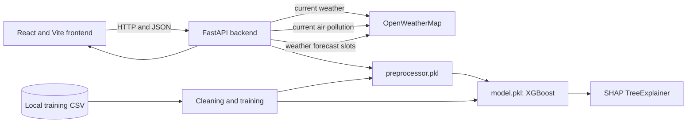

# AQI Forecasting System: Technical Project Report

## 1. Project Overview

The India AQI Forecasting System is a browser application and REST API that estimates the US Air Quality Index (AQI) from a supported city, five weather readings, and six pollutant concentrations. A saved XGBoost regression model produces the score. The response also includes the AQI health category, plain-language advice, and (when SHAP is available) the strongest feature contributions.

Many existing AQI websites and government dashboards report observations from physical monitoring stations. Station placement, reporting scale, and aggregation differ, so values can vary across a city and service. This app instead uses machine learning trained on historical city-level records to estimate a US AQI score from supplied conditions. Its live autofill uses OpenWeatherMap readings, but the prediction is not an official station observation or a replacement for a monitoring network.

## 2. Problem Statement

Pollutant concentrations are difficult for many people to translate into health risk. A score, category, and advice provide a more legible summary. Fixed pollutant-only calculators also do not learn the local relationships among weather, city, time, and multiple pollutants that exist in historical data.

The application addresses these gaps by:

- Accepting weather and pollutant inputs together and estimating one continuous AQI score.
- Loading available current weather and pollutant data when a supported city is selected.
- Applying a saved preprocessing pipeline consistently at inference time.
- Mapping the score to a health category and advice, with SHAP factors to describe the strongest contributions.
- Applying the same model to daily weather forecast summaries to show a short AQI trend.

This does not solve missing or uneven sensor coverage. A fixed coordinate and a provider's spatial product may differ from local station readings; model estimates can also differ from services using another AQI scale or aggregation method.

## 3. Dataset

Training uses `INDIA_AQI_COMPLETE_20251126.csv`, stored locally at `backend/data/`. Project files do not identify the upstream publisher, measurement instruments, or a dataset license. The CSV is excluded from Git because of its size; it was available in the audited workspace.

| Property | Verified value |
|---|---:|
| File size | 282,627,634 bytes (about 282.6 MB) |
| Raw rows and columns | 842,160 × 71 |
| Timestamp range | 2022-08-05 00:00 to 2025-11-26 23:00 |
| Distinct cities | 29 |
| Rows after `clean_data` | 839,644 |
| Rows sampled by current training configuration | 200,000 |

The CSV contains city/state, coordinates, timestamps, numerous weather fields, principal and additional pollutants, environmental values, and US/EU AQI-related targets and categories. The training target is `US_AQI`. Model fields come from `City`, `State`, `Datetime`, optional `Season`, the five weather columns (`Temp_2m_C`, `Humidity_Percent`, `Pressure_MSL_hPa`, `Wind_Speed_10m_kmh`, `Rain_mm`), and six pollutant columns (`PM2_5_ugm3`, `PM10_ugm3`, `NO2_ugm3`, `SO2_ugm3`, `CO_ugm3`, `O3_ugm3`).

The implemented cleaning pipeline normalizes column names, removes exact duplicate rows, converts `US_AQI` to numeric, removes missing or out-of-range targets (valid range 0–500), parses timestamps, converts model numeric fields, trims city/state strings, and treats empty categorical values as missing. Each principal pollutant is clipped to a minimum of zero and then to its 1st and 99th percentiles. The cleaned data is sampled to at most 200,000 records using random seed 42.

Limitations include undocumented dataset provenance/license, no CSV in the repository, data ending in November 2025, a random sample that may miss rare conditions, and no temporal holdout. Pollutant quantiles and imputation/encoding state are fit before the train/test split, so test-set information influences preprocessing and may make reported scores optimistic.

## 4. Feature Engineering

The form/API accept 12 values: `city`, five weather measurements, and six pollutants. The serialized model expects 19 columns:

| Features | Construction and rationale |
|---|---|
| `temperature`, `humidity`, `pressure`, `wind_speed`, `rainfall` | Direct weather fields, allowing the model to learn observed weather/AQI associations. |
| `pm25`, `pm10`, `no2`, `so2`, `co`, `o3` | Direct pollutant concentrations in the dataset's μg/m³ units. |
| `hour` | Hour extracted from `Datetime`; represents within-day patterns. |
| `month` | Calendar month; represents annual variation. |
| `weekday` | Day of week, Monday 0 through Sunday 6. |
| `day` | Day of month. |
| `weekend` | Binary flag for Saturday/Sunday. |
| `season_code` | Winter 0, Spring 1, Summer 2, Monsoon 3, Autumn 4. Reads the dataset `Season` field when present; otherwise maps months (Dec–Feb, Mar–May, Jun–Aug, Sep–Oct, Nov). |
| `city_encoded`, `state_encoded` | `LabelEncoder` integer values fitted to training city/state categories. The state at inference is looked up in the saved city-to-state mapping. |

The 11 measured weather/pollutant values plus six time-derived values and two encoded geography fields total 19 model inputs. Numeric missing values are filled using saved medians; missing categories become `Unknown`. A category not present in the fitted encoder is mapped to the first known label to avoid an inference exception.

Prediction requests have no timestamp, so inference derives hour, month, weekday, day, and weekend from the current UTC time. With no timestamp or `Season` field, the shared feature function currently defaults `season_code` to Summer (2). Forecast dates are also not supplied to the model, so these time features are not advanced for each forecast day.

## 5. Model Training and Selection

`backend/training/train.py` cleans the CSV, samples at most 200,000 rows with seed 42, fits preprocessors, transforms the rows, then performs `train_test_split(test_size=0.2, random_state=42)`. It trains:

- **RandomForestRegressor:** 120 estimators, max depth 18, minimum leaf size 5, `n_jobs=-1`, random state 42.
- **XGBRegressor:** 200 estimators, max depth 8, learning rate 0.08, row/column subsampling 0.85, squared-error objective, `n_jobs=-1`, random state 42.

Both are evaluated using mean absolute error (MAE), root mean squared error (RMSE), and R². Selection prefers lower RMSE, then lower MAE, then higher R². The selected estimator is saved as `backend/app/model/model.pkl`; `preprocessor.pkl` stores numeric medians, categorical encoders, city/state mapping, supported city names, and feature columns.

The checked-in model was loaded from its artifact and confirmed to be an `XGBRegressor` with 19 input features. No committed training logs store model metrics. The following values were independently reproduced for the current artifact without retraining or changing the saved files: cleaning the available CSV, applying the configured seed-42 200,000-row sample, using the committed preprocessor, and evaluating on the corresponding seed-42 20% holdout (40,000 rows).

| Metric | Current artifact result |
|---|---:|
| MAE | 10.3844 AQI points |
| RMSE | 15.0223 AQI points |
| R² | 0.8974 |

These results describe a random holdout evaluation, not validation on later dates, new cities, or an external test dataset. The saved artifact is XGBoost; the training script does not persist the competing model's scores.

## 6. System Architecture

**Frontend:** React 18 single-page application built with Vite. Axios calls the backend. Components render the input form, prediction, AQI education guide, SHAP breakdown, theme toggle, and forecast chart. `API_URL` is explicitly embedded in the Vite build; `VITE_API_URL` remains a temporary compatibility fallback.

**Backend:** FastAPI with Pydantic schemas, served by Uvicorn. The application lifespan loads the saved model and preprocessor and attempts to initialize SHAP. CORS origins are controlled by `CORS_ORIGINS`.

**ML layer:** pandas/NumPy handle rows and numeric arrays; scikit-learn provides encoders, Random Forest, train/test splitting, and metrics; XGBoost is the selected regressor; SHAP calculates local attributions; joblib serializes artifacts.

**External APIs:** One `OWM_API_KEY` is used for OpenWeatherMap current weather, current air pollution, and five-day/3-hour weather forecast endpoints. Live lookups use the fixed city-to-coordinate map in `backend/app/external.py`.

**Data and persistence:** The CSV is a local training input and excluded from Git. `model.pkl` and `preprocessor.pkl` are committed under `backend/app/model/`. The running application has no database or prediction history store.

## 7. Features

### Prediction Pipeline

The frontend requests supported cities, fills available values, permits edits, and validates numeric ranges before submission. The backend validates the request, maps city to state using saved training data, applies saved preprocessing, obtains an XGBoost score, clips it to 0–500, rounds it to an integer, and maps it to a category and health advice with `backend/app/utils.py`.

### Live Autofill

On city selection, weather and pollutant requests run concurrently. OpenWeatherMap `/data/2.5/weather` supplies temperature (metric units), humidity, pressure, wind speed (converted from m/s to km/h), and 1-hour rainfall (zero when omitted). `/data/2.5/air_pollution` supplies PM2.5, PM10, NO2, SO2, CO, and O3 components. OpenWeatherMap documents each requested component in μg/m³, matching the model, so the backend maps the fields directly without unit conversion.

Missing coordinates/key, request exceptions, or absent response data yield null values. The helper uses an eight-second timeout and logs failed requests. `/autofill` returns a `source` state: `full` when some weather and some pollutant data are available, `partial` when only one group is available, and `none` otherwise. The form indicates loading, full, and partial states.

### SHAP Explainability

At startup, the backend tries to create and cache `shap.TreeExplainer` for the loaded model. Each prediction calculates SHAP values for the transformed row, sorts features by absolute impact, and returns up to four contributions. `impact` is signed and rounded to three decimals; `percent` is absolute impact divided by the total absolute impact, expressed as a percentage and rounded to one decimal. The frontend displays a ranked bar chart and direction. If SHAP is unavailable or calculation fails, prediction continues with an empty explanation list.

### AQI Trend Forecast

Selecting a city also requests `/forecast`. The backend asks OpenWeatherMap for up to 40 three-hour weather intervals (120 hours), groups the returned slots by UTC calendar date, averages temperature/humidity/pressure/wind, and sums three-hour rainfall. It uses the same preprocessor and XGBoost model once per grouped date. Current pollutant concentrations are held constant across dates; missing pollutant components use fixed defaults: PM2.5 50, PM10 80, NO2 20, SO2 10, CO 100, O3 30. The frontend renders each returned date's score and category.

**Horizon:** the actual weather source/code provides about five days, not seven. The 120-hour interval can cross a calendar boundary and produce an additional date label. No seven-day forecast source or extension is implemented.

## 8. API Reference

Routes below are taken from the current FastAPI definitions. Interactive schemas are served at `/docs`.

| Method and path | Inputs | Response shape and errors |
|---|---|---|
| `GET /` | None | `{status: "running", model_loaded: boolean}`. |
| `GET /cities` | None | `{cities: string[]}`. Returns 503 if the model/preprocessor is unavailable. |
| `POST /predict` | JSON body containing `city`, five weather values, and six pollutant values. | `{predicted_aqi: integer, category: string, health_advice: string, shap_top: [{feature, impact, percent}]}`. Invalid values return 422; missing model returns 503. |
| `GET /autofill?city={name}` | Required nonempty `city` query parameter. | Nullable weather/pollutant values plus `source: "full" | "partial" | "none"`. External failures are represented by nulls, not route errors. |
| `GET /forecast?city={name}` | Required nonempty `city` query parameter. | `{city: string, days: [{date: "YYYY-MM-DD", predicted_aqi: integer, category: string}]}`. Returns 503 if the model is missing or forecast weather is unavailable. |

`POST /predict` bounds are: temperature −50 to 60 °C, humidity 0–100%, pressure 800–1100 hPa, wind speed 0–200 km/h, rainfall 0–500 mm, PM2.5 0–1000, PM10 0–1500, NO2 and SO2 0–500, CO 0–5000, and O3 0–500 (pollutants in μg/m³). City is a nonblank string of at most 100 characters.

## 9. Technology and Justification

| Technology | Current role |
|---|---|
| Python 3.11.9 | Backend and training runtime. |
| pandas and NumPy | CSV preparation, feature construction, and model arrays. |
| scikit-learn | Encoders, Random Forest baseline, data splitting, and metrics. |
| XGBoost | Selected gradient-boosted regressor for tabular features. |
| SHAP | Local TreeExplainer contributions for the XGBoost result. |
| joblib | Save/load the model and fitted preprocessing artifacts. |
| FastAPI, Pydantic, Uvicorn | HTTP routing, request/response validation, async service, and hosting. |
| HTTPX and python-dotenv | Async OpenWeatherMap calls and local environment loading. |
| React, Vite, Axios, CSS | Interactive single-page UI, build system, HTTP client, and styling. |
| Render and Vercel | Separate backend API and static frontend deployment. |

## 10. Known Limitations

- The AQI trend is about five days, not seven. It reuses current pollutant values for all dates and does not forecast pollutant concentrations.
- Inference time features use current UTC time; the fallback season is hardcoded to Summer. Forecast date/time does not reach model feature generation.
- Model-supported cities and the external coordinate table are separate. Some of the saved model's 29 city names are absent from the coordinate mapping, so autofill can return no live readings there.
- Fixed-coordinate OpenWeatherMap values need not match local monitors or a citywide average. The API's own 1–5 index is not the US AQI scale predicted by the model.
- Preprocessing and pollutant clipping statistics are fitted before the random holdout split. The evaluation is not time-based, and its reported values may be optimistic for future data.
- Dataset source/licensing is undocumented in the repository, the CSV is not committed, and training samples 200,000 rows.
- SHAP failure suppresses explanations but not predictions. Live autofill can fail; forecast uses fixed pollutant defaults for missing fields.
- Results are estimates, not certified measurements or official alerts. The frontend labels advice with US EPA AQI bands while the target data's detailed provenance is not documented.

## 11. Future Scope

Possible improvements, not currently implemented: document the dataset source and license; fit preprocessing only on training folds and add time-based/external validation; save model version and evaluation reports; align supported cities and coordinate coverage; compare predictions against official observations; and consider a seven-day forecast only after selecting a source with that horizon and validating the model's use of future pollutant inputs. These are evidence-based opportunities, not committed product plans.

## 12. Deployment

The frontend is deployed from `frontend/` on Vercel. The backend deploys from `backend/` on Render using `render.yaml`, which installs `requirements.txt` and starts Uvicorn. The frontend calls the backend URL baked into its Vite build. Render's CORS list must include the deployed frontend origin.

| Variable | Local/deployment location | Purpose |
|---|---|---|
| `OWM_API_KEY` | `backend/.env`; Render environment settings | OpenWeatherMap weather and air-pollution access. |
| `CORS_ORIGINS` | `backend/.env`; Render environment settings | Comma-separated browser origins; local defaults are provided in code. |
| `API_URL` | `frontend/.env`; Vercel environment settings | Backend base URL explicitly compiled into the frontend. |
| `PYTHON_VERSION` | Render Blueprint (`render.yaml`) | Pins the deployment runtime to Python 3.11.9. |
| `PORT` | Automatically supplied by Render | Port used by the Uvicorn start command; not a secret or a manually configured local variable. |

`backend/app/config.py` loads dotenv values and reads environment variables. Real deployment values must be managed in Render/Vercel settings; committed files contain variable names/placeholders only. `.gitignore` excludes `.env` files. Backend and frontend examples are `backend/.env.example` and `frontend/.env.example`. The external hosting dashboards were not accessible during this repository audit, so their currently configured secret values cannot be independently verified here.

For local development, install `backend/requirements.txt`, set `OWM_API_KEY` in `backend/.env`, and run `uvicorn app.main:app --reload --port 8000` from `backend/`. Install frontend packages with `npm install`, set `API_URL=http://localhost:8000` in `frontend/.env`, and run `npm run dev` from `frontend/`. The CSV is needed only for retraining; committed model artifacts power inference.